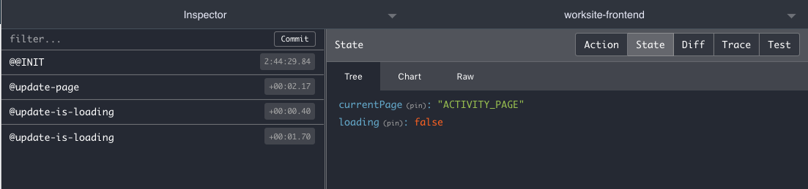

# redux dev tools for [js-atom v2](https://github.com/exodevhub/js-atom)

# Breaking Change:
#### As of version 2, Log Rocket support has been removed.

```ts
import atom from 'js-atom';
import atomReduxDevTools from 'atom-rdt';
const APP_VERSION = 1.0.1
// Setup
const store = createAtom({});
store.addWatch('rdt-watcher', atomReduxDevTools);

// Reducer
function myReducer(somethingNew) {
  return store.swap(oldState => ({ ...oldState, somethingNew }), 'my-action-type');
}
```

#### Outputs


